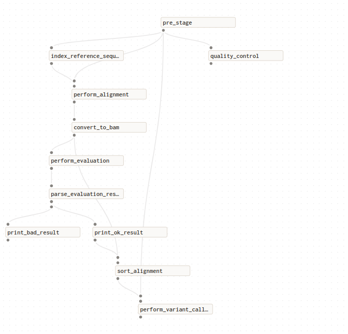

# 💻 Домашнее задание

## Тема
Построение пайплайна получения генетических вариантов

## Ссылки на данные
Загруженное прочтение: https://trace.ncbi.nlm.nih.gov/Traces/?view=run_browser&acc=SRR24541530&display=metadata <br/>
Референсный геном: https://www.ncbi.nlm.nih.gov/assembly/GCF_000005845.2/

## Скрипт на bash
Скрипт для получения генетических вариантов расположен в папке `bash`. Перед запуском необходимо убедиться, что на рабочую машину установлены следующие утилиты:
* fastqc - https://www.bioinformatics.babraham.ac.uk/projects/fastqc/
* bwa - https://github.com/lh3/bwa
* samtools - https://github.com/samtools/samtools
* freebayes - https://github.com/freebayes/freebayes.

Далее необходмо проверить, что в корневой директории расположены:
* ecoli.fastq - загруженное прочтение
* ecoli.fna - референсный геном.

После этого можно запустить скрипт при помощи команды :
```
./genetic_variants.sh
```
В результате будет получена оценка выравнивания (`bash/output/flagstat.txt`) и в случае высокой оценки будут получены генетические варианты (`bash/output/result.vcf`).

Для разбора результатов оценивания будет использоваться скрипт `bash/quality_evaluation.py`.

На логи исполнения скрипта для получения генетических вариантов можно посмотреть в файле `bash/genetic_variants.log`.

## Инструкция по развертыванию и установке фреймворка
**Установите программное обеспечение**

Установите Python версии 3.7+ и пакетный менеджер pip, если они еще не установлены.

Инструкции по установке необходимого программного обеспечения можно найти по следующим ссылкам:
* Python: https://wiki.python.org/moin/BeginnersGuide/Download
* pip: https://pip.pypa.io/en/stable/installation/.

**Создайте виртуальное окружение**

Рекомендуется использовать Dagster в виртуальном окружении, поэтому для работы с фреймворком необходимо сначала создать виртуальное окружение при помощи команды:
```
python3 -m venv dagster_env
```

и далее активировать его при помощи команды:
```
source dagster_env/bin/activate
```

**Установите Dagster с помощью pip**

Чтобы установить последнюю стабильную версию основных пакетов Dagster в  текущей среде Python, запустите:
```
pip install dagster dagit
```

В данном случае будут установлены следующие пакеты Python:
* dagster - инструмент интерфейса командной строки (CLI) для запуска Dagster
* dagit - веб-интерфейс для управления пайплайнами Dagster, редактор конфигураций с поддержкой типов и интерфейс для запуска пайплайнов в реальном времени.

**Создайте проект на Dagster**

Чтобы создать проект, запустите:
```
dagster project scaffold --name hello_world
```

Чтобы убедиться, что локально все работает, запустите:
```
cd hello_world
dagster dev
```
Перейдите на localhost:3000. Вы должны увидеть пользовательский интерфейс Dagster. Эта команда будет запускать Dagster до тех пор, пока вы не будете готовы остановить его. Чтобы остановить процесс, нажмите Ctrl+C на терминале, на котором он был запущен.

**Создайте пайплайн для решения вашей задачи**

На этом установка Dagster завершена и можно приступать к написанию пайплайнов. Познакомиться с процессом создания пайплайнов можно в следующем уроке: https://docs.dagster.io/tutorial/introduction.

## Тестовый пайплайн
Тестовый пайплайн расположен в папке `test`.

Код пайплайна расположен в файле `test/hello_world.py`, а логи его запуска расположены в файле `test/hello_world.log`.

Для запуска пайплайна необходимо убедиться, что установлена утилита Dagster, и выполнить следующую команду в директории с пайплайном:
```
dagster job execute -f hello_world.py
```

## Итоговый пайплайн
Пайплайн для получения оценки качества картирования расположен в папке `pipeline`.

Также, как и перед запуском скрипта на bash, необходимо проверить, что на рабочей машине установлены нужные утилиты и в корневой директории находятся требуемые файлы с данными.

После выполнения всех условий можно запустить пайплайн при помощи команды:
```
dagster job execute -f genetic_variants.py
```

Визуализировать пайплайн можно при помощи команды:
```
dagit -f genetic_variants.py
```
В результате работы пайплайна будут получены следующие файлы:
* `pipeline/output/flagstat.txt` - оценка качества картирования
* `pipeline/output/result.vcf` - генетические варианты
* `bash/genetic_variants.log` - логи пайплайна (включая оценку качества картирования OK/BAD)

## Сравнение алгоритмов
<figure align='center'>
  
  <ficapture>Визуализация пайплайна.</ficapture>
</figure>

Благодаря графическому интерфейсу Dagster позволяет:
* читать информацию о пайплайнах и наборах данных
* запускать пайплайны
* визуализировать пайплайны

Стандартный пайплайн представляет собой граф, вершинами которого являются операции. На графе две последовательно связанные операции обозначаются ребром с двумя вершинами на концах. Связь между операциями определяется данными, которые эти операции делят между собой, и порядком их исполнения. Вследствие этого можно наблюдать некоторые различия в визуализации полученных алгоритмов оценки качества картирования.

Например, визуализация пайплайна отображает, что входные данные ecoli.fastq и ecoli.fna, получаемые после выполнения операции `@op pre_stage`, необходимы для начала работы других операций: `@op quality_control`, `@op index_reference_sequence`, `@op perform_alignment` и `@op perform_variant_calling`. С другой стороны, операции `@op index_reference_sequence` и `@op quality_control` не зависят друг от друга, а потому выполняются фреймворком параллельно, что можно увидеть в логах.

В целом полученные изображения алгоритмов довольно схожи и достаточно хорошо описывают последовательность действий, которую необходимо выполнить для оценки качества картирования. Названия операций в пайплайне аналогичны названиям блоков в блок-схеме, в двух схемах присутствует ветвление, зависящее от оценки качества выравнивания. Однако визуализация пайплайна более точно показывает связь между частями алгоритма, поскольку учитывает передачу данных между ними.


