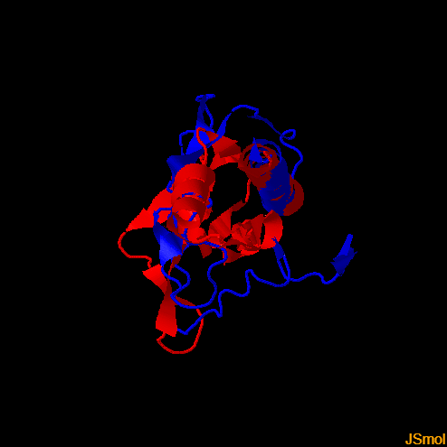
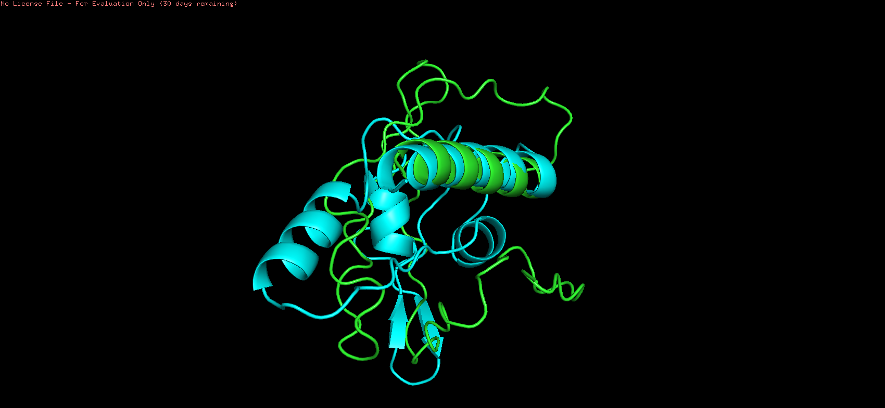

# 🧬 Домашнее задание

## Тема

Предсказание и парное выравнивание структур белков

## Последовательность, название программ-предсказателей и программы-выравнивателя

**Последовательность:** MVEYFGQNLNGFLFTKNAWVQSYGTRCVKPPIVWGDVSRANPITVEWSAYAQSKTDHVMKGMLTGPVTILNWSWPREDITHEEQTKQLALAIRDEVLDLE

**Инструменты фолдинга белков:**

- [ESMFold](https://colab.research.google.com/github/sokrypton/ColabFold/blob/main/ESMFold.ipynb)
- [OpenFold](https://colab.research.google.com/github/aqlaboratory/openfold/blob/main/notebooks/OpenFold.ipynb)

**Инструмент парного выравнивания:** [TMAlign](https://zhanggroup.org/TM-align/)

**Инструмент визуализации:** [PyMOL](https://pymol.org/2/)

## Полученные ноутбуки с предсказанной структурой

**ESMFold:**

- [Google Colaboratory](https://colab.research.google.com/drive/1MM_qSZsz5EzfUm_szxZqZfkBYG_7GcgO?usp=sharing)
- [Notebook.ipynb]()

**OpenFold:**

- [Google Colaboratory](https://colab.research.google.com/drive/1QZrJjq__T7Is2HBVAeP5a5YK3Xo8_NED?usp=sharing)
- [Notebook.ipynb]()

## Полученные предсказания структур в формате PDB

**ESMFold:** [Prediction.pdb]()

**OpenFold:** [Prediction.pdb]()

## Полная выдача программы выравнивания

**Файлы:**

- [C683043.pdb]() - superposed Ca-traces in the aligned regions
- [D683043.pdb]() - superposed Ca-traces of entire chain
- [E683043.pdb]() - superposed full-atom structure in the aligned region
- [F683043.pdb]() - superposed full-atom structure of the entire chain
- [G683043.pdb]() - superposed full-atom structure of the entire chain with ligands/solvents
- [Output.txt]() - TMalign results message

**Изображения:**

|                         Superposition of two proteins                         |                                      Superposition of two proteins with ligands and solvents                                      |
| :---------------------------------------------------------------------------: | :-------------------------------------------------------------------------------------------------------------------------------: |
|  |  |

## Сессия из программы визуализации

**Сессия:** [Session.pse]()

## Снимок экрана с полученным раскрашенным выравниваем

**Раскрашивание:**

- Зеленый цвет - ESMFold
- Голубой цвет - OpenFold

## Краткие выводы о совпадении полученных предсказаний

На первый взгляд может показаться, что предсказания получились разные. Однако визуализация выравнивания показывает, что данные предсказания обладают несколькими схожими участками. Таким образом, можно сказать, что предсказания крайне схожи между собой.

Следует также ожидать, что в будущем мы будем получать более точные предсказания молекулярных структур, поскольку в настоящее время область искусственного интеллекта начала стремительно развиваться.
