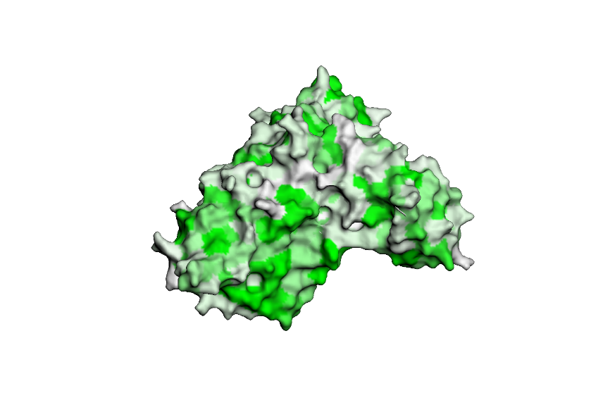
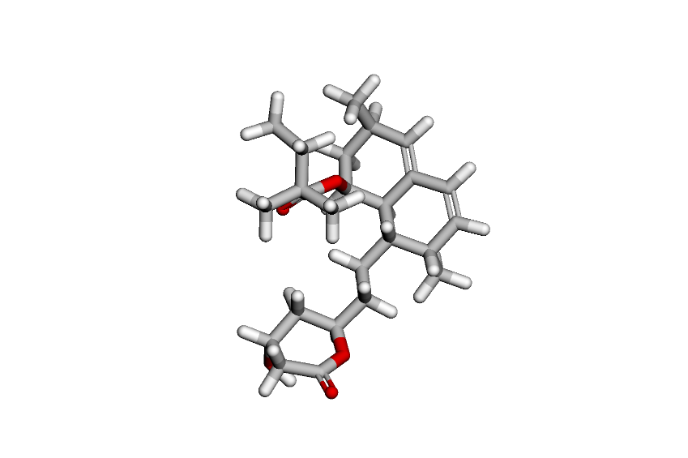
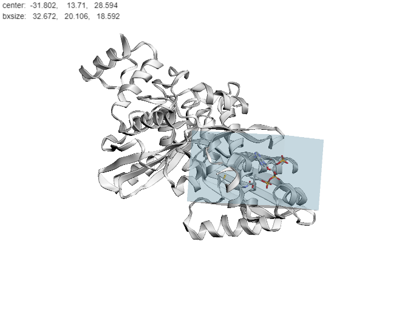
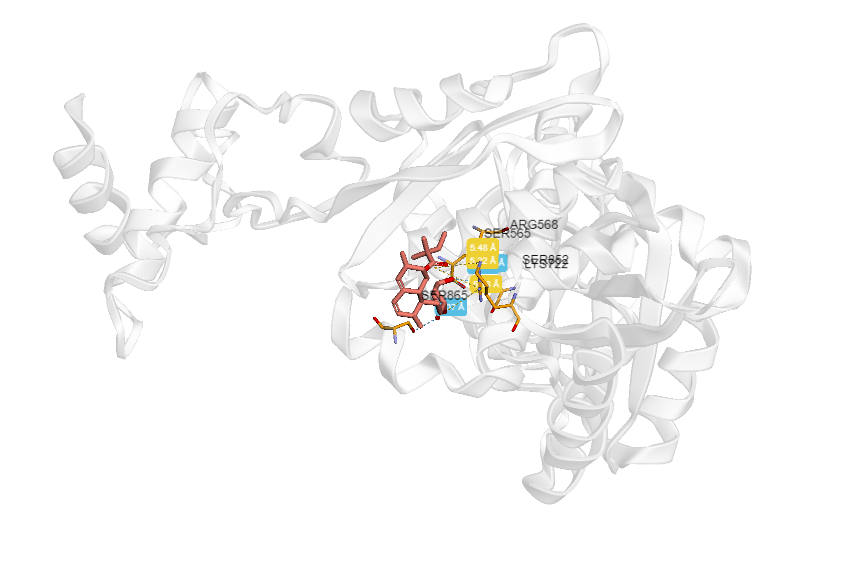

# 💊 Домашнее задание

## Тема

Докинг лекарственных молекул

## 1. Полученная информация о препарате

**Действующее вещество:** Симвастатин (Simvastatin)

**Область применения:** Используется для лечения пациентов с повышенным уровнем холестерина в крови, а также для предотвращения сердечно-сосудистых заболеваний, таких как инфаркт миокарда и инсульт

**Молекулярный механизм действия:** Подавляет активность фермента ГМГ-КоA редуктазы. Этот фермент играет важную роль в процессе образования холестерина в организме. Подавляя активность этого фермента, симвастатин помогает снизить уровень холестерина в крови

## 2. Полученный ноутбук с выполненным докингом

**Файл:** [Notebook.ipynb](https://github.com/PeachMood/bioinformatics/blob/main/task6/Notebook.ipynb)

**Google Colab:** [Notebook](https://colab.research.google.com/drive/1rHZnPqs9ZqxdQIrfgrChtaccGhI5YjaR?usp=sharing)

## 3. Полученный результат докинга в формате PDB

**Папка с результатами:** [/Docking](https://github.com/PeachMood/bioinformatics/blob/main/task6/Docking)

## 4. Изображения

**Трехмерная структура подготовленного таргета**

**Трехмерная структура исходного лиганда**

**Полученный бокс**

**Полученный докинг**

